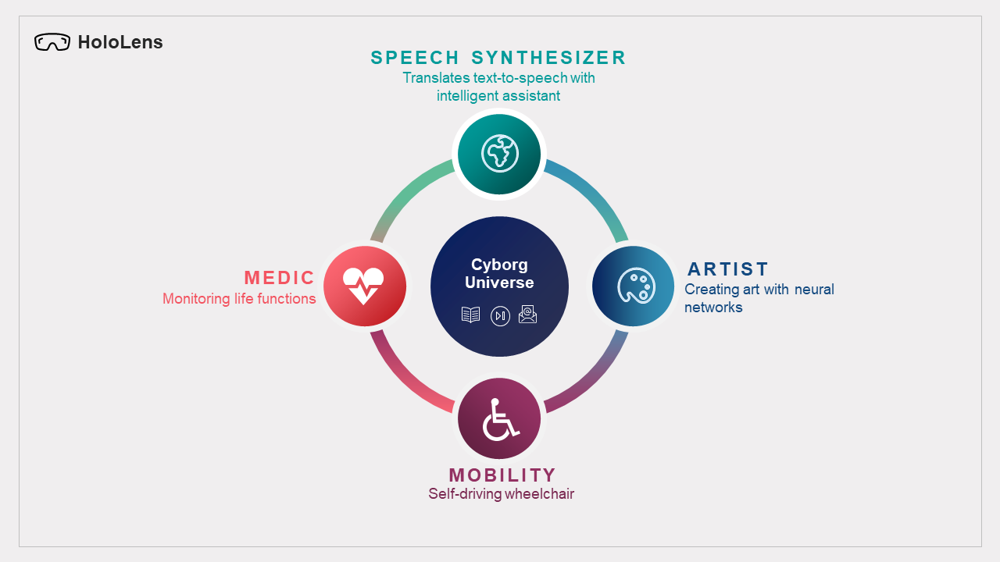

# The Cyborg Universe

**Background:** Dr. Peter Scott Morgan, a very passionate roboticist, has been diagnosed with motor neuron disease, which disabled him from moving every part of his body except his eye. This project is geared towards his goal to be the world's first full Cyborg (combining his humanity with artificial intelligence and robotics) and in transforming the User Interface to aid people with extreme disabilities. 

**The Problem:** People with extreme disabilities feel trapped in their own bodies. There is a need to be independent and to be free from their paralyzed body.

**The Solution:** Our main goal is to create an immersive, eyes-only content navigation and control system in a Mixed Reality device (HoloLens) to help people with disability communicate and do their day-to-day activities. The Cyborg Universe is not just a single application, but an environment that would contain applications to achieve the goal. 

**Potential Impact:** The Cyborg Universe can be an ecosystem for people with disability to interact with the world.

## Getting Started
[I. Project Overview](#Overview)  
[II. Design](#Design) 
[III. Features](#Features) 
[IV. Application Setup](#AppSetup) 
[V. Development Guidelines](GUIDELINES.md) 
[VI. Deployment](#Deployment) 
[VII. References & Useful Links](#Links) 

## I. Overview
The Cyborg Universe serves as the main eye-gaze powered cyberspace where the user could navigate and use the existing applications within. 

The Cyborg Universe contains customization controls like pause and minimize, and basic applications such as music player, browser, email and news widget. It currently has the ff. four(4) core applications:

**1. Cyborg Speech Synthesizer** - enables the user to input text via eye gaze which will then be translated to a customized voice speech with emotion. It is also connected to an external avatar that invokes facial expression. 

**2. Cyborg Artist** - allows the user to compose art with artificial intelligence. It stores the created images in a gallery.

**3. Cyborg Mobility** - equips the user with controls to faciliate a self-driving wheelchair to reach places. It stores a map to enable point selection. 

**4. Cyborg Medic** - enables real-time monitoring and emergency alert of life functions such as oxygen and heartbeat rate. It contains voice support to assist and announce cautions.

## **II. The Design**

## **III. Features**

## **IV. Application Setup**
The detailed setup instructions are described below to start running the application. Each universe application would require some additional setup and tools. Install and setup as necessary.

### **1. General Cyborg Setup**
The Cyborg Universe and its applications are all created with Unity and written in C#. 

  1. [Download Unity Hub](https://unity3d.com/get-unity/download) to manage your unity projects and installations.
  2. Install [Unity Version 2019.4.3](https://unity3d.com/unity/whats-new/2019.4.3) with unity hub. 
      - Add *Universal Windows Platform Build Support* module to support development for HoloLens device
  3. Download and Install [Visual Studio](https://visualstudio.microsoft.com/downloads/). 
      - Include the ff. __workloads__: *Desktop develpoment with C++*, *Universal Windows Platform development* and *Game development with Unity* to allow development with Unity
      - Under *Universal Windows Platform development*, include the *USB Device Connectivity* to allow deployment to device
   4. Launch the [Cyborg Universe application](Code/Development) from Unity Hub.
   
### **2. The Avatar**

### **3. The Mobility**

### **4. The Oximeter**

## **V. Development Guidelines**

## **VI. Deployment**

## **Useful Links**

[MRTK](https://microsoft.github.io/MixedRealityToolkit-Unity/Documentation/WelcomeToMRTK.html) is a cross-platform toolkit for building Mixed Reality experiences for Virtual Reality (VR) and Augmented Reality (AR). 

[MRTK Eye Tracking](https://microsoft.github.io/MixedRealityToolkit-Unity/Documentation/EyeTracking/EyeTracking_BasicSetup.html) is the eye tracking feature of the MRTK used in the Universe application.

[MRTK Spatial Awareness](https://microsoft.github.io/MixedRealityToolkit-Unity/Documentation/SpatialAwareness/SpatialAwarenessGettingStarted.html) provides real-world environmental awareness in mixed reality applications. When introduced on Microsoft HoloLens, Spatial Awareness provided a collection of meshes, representing the geometry of the environment, which allowed for compelling interactions between holograms and the real-world. This is used in Mobility application.

[Punch Keyboard](https://github.com/rjth/Punchkeyboard) is an open-source keyboard for virtual reality, enhanced with autocomplete and next word prediction functionality for a swift typing experience. It was created with Unity and written in C#. The built in prediction is based on Reddit conversation corpus, however the repository contains functionality for creating custom dictionaries for personalised suggestions as well.

[Vuplex Browser](https://developer.vuplex.com/webview/overview) is the ultimate cross-platform web browser for Unity

[Asset Usage Detector](https://assetstore.unity.com/packages/tools/utilities/asset-usage-detector-112837) is a tool that helps you find usages of the selected asset(s) and/or Object(s) in your Unity project, i.e. lists the objects that refer to them.
